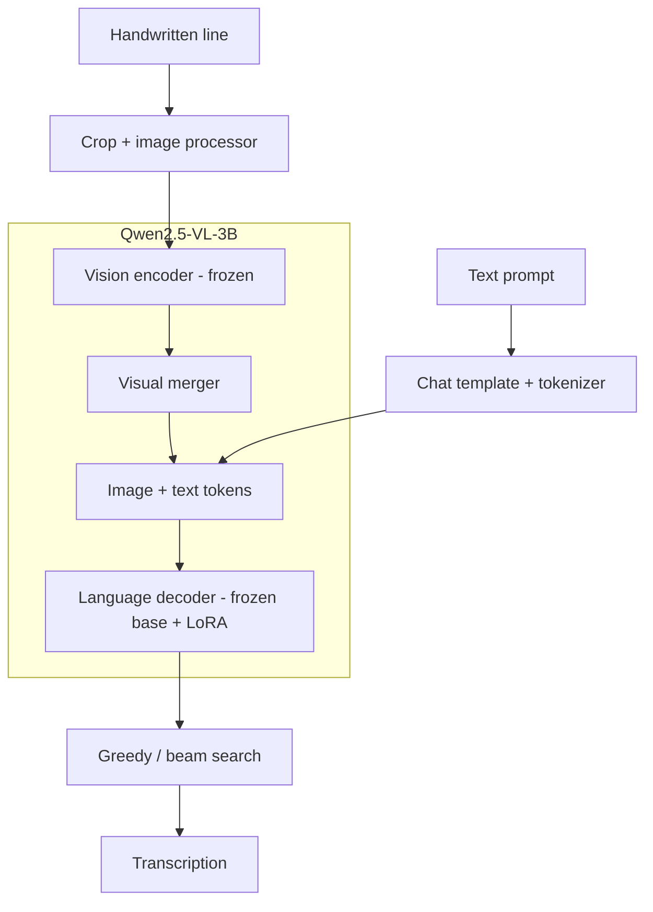

# Historical Handwriting Recognition with Qwen2.5-VL

An architecture prototype combining Qwen2.5-VL-3B, LoRA, StackMix-style
augmentation and minimum word error rate (MWER) training.
Full model training and recognition accuracy remain unverified.

## Model architecture

**SFT:** update LoRA + visual merger. **MWER:** update LoRA only; merger frozen.

[MIT](LICENSE). Model weights and datasets are not included.
