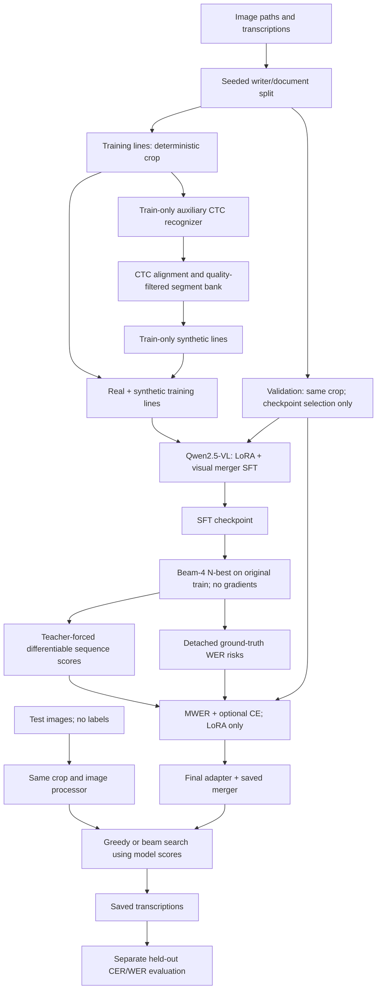

# Historical Handwriting Recognition with Qwen2.5-VL

A modular research repository for **Qwen/Qwen2.5-VL-3B-Instruct**, LoRA supervised
fine-tuning, train-only CTC-aligned StackMix-style augmentation, beam search, and
differentiable minimum word error rate (MWER) fine-tuning.

**Validation status:** CPU unit/integration tests and the complete E0–E5 smoke
pipeline run with generated dummy images and a tiny, randomly initialized **real
Transformers Qwen2.5-VL model and processor**. These checks establish software
behavior, not recognition quality. Full pretrained 3B training, CUDA/bf16 training,
and historical-dataset experiments have **not** been run here. No benchmark
improvements are claimed. No competition data, external text corpus, copyrighted
images, or pretrained weights are included.

## Motivation

Historical handwriting combines visual ambiguity with obsolete spelling,
punctuation, and writer variation. Token-level likelihood does not directly
optimize transcription errors. This project isolates adaptation, additional
synthetic training images, decoding search, and sequence-level risk optimization
under a shared evaluation protocol.

## Methodology



**Beam search is a decoding/search method, not a training objective. MWER is
sequence-level minimum-risk fine-tuning, not PPO/GRPO-style reinforcement learning.**
WER is non-differentiable; gradients flow through sequence probabilities.
StackMix uses only training data. Test ground truth is never used for model
selection, augmentation, decoding, or candidate ranking.

## Installation

Python **3.12+** is required; local verification used Python 3.13 on macOS ARM64.
Use a CUDA machine for pretrained 3B experiments. Memory demand depends on image
tokens, response length, batch size, and N-best size; no unmeasured VRAM minimum
is asserted.

```bash
python3 -m venv .venv
source .venv/bin/activate
python -m pip install -r requirements.txt
python -m pytest -q
python scripts/smoke.py --phase 6
```

Direct dependencies are pinned in `pyproject.toml`: Transformers 5.17.0, PEFT
0.21.0, Torch 2.14.0 and torchvision 0.29.0. The implementation uses
`Qwen2_5_VLForConditionalGeneration` and `AutoProcessor`, without remote model code
or third-party trainer copies. torchvision supports the current processor's video
component even though this project uses still images only.

`requirements-tested-macos-arm64.txt` records the tested package set without local
editable paths. It is an environment snapshot, **not a CUDA or cross-platform
lockfile**. Install a matching CUDA-enabled PyTorch build on the research machine
and retain that run's environment metadata. CI is configured for Linux CPU tests;
the hosted GitHub Actions workflow has not yet been executed here.

All commands also work through `python -m htr.cli`. The scripts in `scripts/` are
thin wrappers around the same importable research modules.

## Dataset format and leakage controls

Labeled CSV files require `image_path,transcription`. Example only:

```csv
image_path,transcription,writer_id
lines/line_0001.png,"Received six shillings.",writer_A
lines/line_0002.png,"Paid in full, 1798.",writer_B
```

Paths are relative to `data.image_root`; paths or symlinks escaping that root are
rejected. Optional `image_id` values use letters, digits, `_` or `-`; otherwise IDs
are derived from canonical relative paths. CSV quoting preserves label whitespace,
commas, spelling, and punctuation. Configure `configs/data.yaml` for real data:

```yaml
project_root: ..
seed: 42
data:
  image_root: data/private
  source_csv: data/private/train.csv
  validation_csv: null
  test_csv: null
  group_column: writer_id
  validation_fraction: 0.2
  split_dir: artifacts/splits
```

With `validation_csv: null`, a fixed seed splits entire groups. Use a writer or
document column; the fraction then applies to groups, not exactly to line counts.
To hold out both writer and document, precompute connected-component group IDs
from their relationships. If no grouping metadata exists, explicitly set
`group_column: null` for a weaker line-level split. An explicit `validation_csv`
is supported and checked. Optional `test_csv` is read **without transcriptions**,
and checked against both other splits.

Manifests contain IDs, canonical paths, labels, groups, image byte SHA-256 hashes,
and split fingerprints. Overlapping IDs, paths, identical image bytes, and
configured groups fail. Downstream stages recheck manifest and image hashes.
Changed splits require a new `split_dir`. Near-duplicate scans, incorrect writer
metadata, and unknown overlap with public-model pretraining still require separate
curation or disclosure.

```bash
htr dummy --output data/dummy --count 20 --seed 42
htr prepare-data --config configs/data.yaml
```

Dummy data uses Pillow's bundled font and original generated sentences. These
are printed software fixtures, not simulated historical handwriting or a benchmark.

## Configuration and paths

YAML supports `extends` and dotted overrides, e.g. `--set crop.enabled=false`.
Unknown keys fail. `project_root` is relative to the YAML file **declaring** it;
inherited paths keep that root. All data/artifact/checkpoint/output paths come
from configuration or CLI arguments; there are no user-specific source paths.

For published runs, set `model.revision` to an immutable Hub commit. Default
`main` is resolved once through `AutoConfig`, then processor and weights load
that same revision. Bundles record it for reloads. A local model directory can
be supplied through `model.name` for offline pretrained runs.

## Crop preprocessing

Cropping retains the bounding box of **all** grayscale pixels below the threshold,
plus padding. Blank images retain their original dimensions. Defaults are threshold
235 and padding 8 pixels. There is no component pruning, stretching, deskewing,
or background normalization. Cropping changes the canvas without distorting ink;
segment height normalization later uses proportional resizing.

Dark borders can prevent tight crops and faint ink can be missed. Inspect training
overlays using `--set crop.debug_dir=outputs/crop_debug`. For a disabled-crop
ablation use `--set crop.enabled=false` and fresh artifact/run paths. Checkpoints
enforce the training crop, prompt, and pixel budget during inference. Qwen's own
patch-aligned image resize remains part of the saved processor.

## CTC-aligned StackMix-style augmentation

This is an implemented **CTC character-segment variant inspired by StackMix**,
not an exact reproduction of the paper's full system. There is no equal-width
segmentation or manual character cropping.

1. Train a small convolutional, bidirectional-LSTM CTC recognizer from scratch on
   cropped original training lines. Vocabulary and fixed-epoch training use only train.
2. Reject lines whose training-label greedy CER exceeds `max_alignment_cer`.
3. Apply transcript-constrained CTC Viterbi alignment. Repeated characters require
   intervening blanks; boundaries follow aligned frames and divide blank gaps.
4. Filter patches by mean aligned emission probability and minimum ink fraction.
   Cache source IDs, labels, boundaries, qualities, split/crop/CTC hashes, and images.
5. Sample words **only from training transcriptions**, then compose their character
   images from the bank. No external corpus, validation text, or test text is used.

`synthetic_ratio=1.0` adds `floor(N_train × 1.0)` synthetic lines. Synthetic text
uses one space between sampled words; original labels are untouched. Configure
height, character spacing, word spacing, quality threshold, and word-count bounds.
`style_consistent=true` restricts words and characters to one group per line.
`stackmix.synthetic_dir` must be under `data.image_root`; update both for real data.

The small CTC recognizer is a bootstrap model, not a pretrained handwriting expert.
Emission probabilities are quality heuristics, not calibrated boundary confidence.
Cursive joins, punctuation, and seams remain limitations. An empty bank or missing
word coverage fails clearly; there is no uniform-cut fallback. Improve the CTC fit
and inspect training segments before E2–E5. Smoke tests explicitly relax quality
thresholds to exercise code, not to establish alignment quality.

## Qwen2.5-VL and LoRA SFT

The configurable prompt defaults to:

```text
Transcribe the handwritten text exactly.
Preserve the original spelling and punctuation.
Output only the transcription.
```

| Component | SFT | MWER |
| --- | --- | --- |
| Vision encoder | Frozen | Frozen |
| Visual merger | Trainable | Frozen at SFT weights |
| LLM base | Frozen | Frozen |
| LLM LoRA | Trainable | Trainable |

Startup discovers the actual `visual`, `visual.merger`, and `language_model`
modules. Full names target only existing LLM linear projections: `q_proj`,
`k_proj`, `v_proj`, `o_proj`, `gate_proj`, `up_proj`, `down_proj`. Missing targets
fail. All trainable names/sizes, total counts, and trainable percentage are logged.
Defaults are rank 16, alpha 32, dropout 0.05, bias `none`; this frozen-base design
intentionally rejects bias training.

$$\mathcal{L}_{\mathrm{SFT}}=-\sum_t\log P_\theta(y_t^*\mid I,q,y_{<t}^*).$$

The processor chat template encodes the image/prompt prefix; transcription tokens
and **one assistant EOS** are appended. Prefix and padding labels are `-100`.
No image placeholders, user tokens, or following template newline contribute to
loss. Position-based masking preserves active EOS even if PAD/EOS IDs coincide.
Reserved control tokens in labels and overlong sequences fail instead of being
silently altered or truncated.

Training uses token-average CE with exact token weighting across accumulation
windows, including partial windows. CUDA bf16 is selected when supported,
otherwise float32. Non-reentrant gradient checkpointing is available. Validation
CE and greedy CER/WER are measured each epoch; **validation combined score**
selects `best/` and drives optional early stopping. No test samples enter selection.

## Greedy and beam search

All decoding uses `do_sample=False`. Greedy, Beam-2 and Beam-4 use 1, 2 and 4 beams.
Ranking uses model generation scores and configured length penalty only.
References and WER are not decoder arguments. One warm-up image is excluded from
timing; per-image generation is synchronized on CUDA, uses batch size one, and
excludes image loading/cropping. Average output token and character lengths are
reported. Compare timing on identical hardware, dtype, inputs, and generation limits.

## N-best rescoring and MWER

Beam-4 generates up to four unique **token sequences** from the SFT checkpoint
on original training images. JSONL stores `image_id`, `ground_truth`, candidate
texts, exact generated `token_ids`, and termination flags. Generation uses
`torch.no_grad()`. Provenance binds the cache to the SFT adapter, merger,
processor, settings, and train split. MWER uses **fixed offline N-best support**;
candidates are not refreshed during training.

Candidates are passed through the model again with teacher forcing:

$$s_i=\frac{\sum_t\log P_\theta(y_{i,t}\mid I,q,y_{i,<t})}{|y_i|^\alpha},
\qquad p_i=\operatorname{softmax}(s)_i.$$

`mwer.length_normalization` is alpha: 0 means a raw sum, 1 a token average.
Scores include an EOS when generated. Truncated candidates remain prefixes,
without an invented EOS. Candidate text is checked against saved token IDs to
avoid decode/re-tokenize drift. Causal shifting and assistant-only masking also
apply here. **Detached `generate()` scores are never used for backpropagation.**

$$R_i=\operatorname{WER}(y_i,y^*),\qquad
\mathcal{L}_{\mathrm{MWER}}=\sum_i p_i\left(R_i-\frac1N\sum_jR_j\right).$$

Risks are explicitly detached. Mean-risk centering is configurable; for an exact
softmax expectation it shifts the loss but leaves its gradient unchanged.
Centered losses can be negative. Identical risks yield zero MWER gradient;
`risk_spread` is logged so this limitation is visible.

$$\mathcal{L}_{\mathrm{total}}=\mathcal{L}_{\mathrm{MWER}}
+\lambda_{\mathrm{CE}}\mathcal{L}_{\mathrm{CE}},\qquad\lambda_{\mathrm{CE}}=0.1.$$

Use `mwer.center_risks=false` for an uncentered ablation or `mwer.lambda_ce=0` for
pure MWER. Hybrid CE is token-averaged per reference; MWER averages N-best lists.
Evaluation mode disables dropout during rescoring while autograd remains enabled
for LoRA. Optional outer non-reentrant checkpoints recompute scoring in backward.
Frozen SFT merger weights are included in every final adapter bundle.

## Training commands

```bash
# Original-only SFT
htr train-sft --config configs/sft.yaml

# Train-only CTC, bank, synthesis, augmented SFT
htr train-ctc --config configs/stackmix.yaml
htr build-stackmix-bank --config configs/stackmix.yaml
htr synthesize --config configs/stackmix.yaml
htr train-sft --config configs/stackmix.yaml

# SFT N-best, then sequence-level adaptation
htr generate-nbest --config configs/mwer.yaml
htr train-mwer --config configs/mwer.yaml
```

Bundles contain `adapter_model.safetensors`, `adapter_config.json`,
`merger.safetensors`, `processor/`, `base_config/`, and `bundle.json`. Frozen base
weights are not copied. `training_state.pt` contains the trainable optimizer state,
epoch, best score, patience counter, and Python/NumPy/Torch/CUDA RNG states.

Resume at a **completed epoch boundary**, in the same run directory:

```bash
htr train-sft --config configs/sft.yaml \
  --set train.resume=runs/sft/last --set train.epochs=6
```

Only `train.epochs` and `train.resume` may change for exact continuation. The CPU
test checks bitwise equality with uninterrupted training, including LoRA dropout.
A mid-epoch interruption restarts from the previous completed epoch. Use `last/`
for continuation. New runs refuse to overwrite existing run metadata.

## Inference commands

```bash
# E0, zero-shot validation
htr infer --config configs/inference.yaml --set train.checkpoint=null \
  --set decode.output=outputs/zero_shot.jsonl

# Same SFT checkpoint, different search widths
htr infer --config configs/inference.yaml --set decode.num_beams=1
htr infer --config configs/inference.yaml --set decode.num_beams=2 \
  --set decode.output=outputs/beam2.jsonl
htr infer --config configs/inference.yaml --set decode.num_beams=4 \
  --set decode.output=outputs/beam4.jsonl

# Final model, image-only external CSV (replace this illustrative CSV path)
htr infer --config configs/inference.yaml \
  --set train.checkpoint=runs/mwer/best \
  --set decode.input_csv=data/dummy/test_images.csv \
  --set decode.num_beams=4 --set decode.output=outputs/test.jsonl
```

External inference CSVs need only `image_path` and optional `image_id`. A
transcription column is ignored even if present. Final inference performs no
StackMix, WER calculation, or reference-based ranking. Use the training crop and prompt.

## Evaluation and metric conventions

```bash
htr evaluate --config configs/inference.yaml
htr evaluate --config configs/inference.yaml --set decode.output=outputs/beam4.jsonl

# Read held-out labels only after predictions are saved; supply your own CSV
htr evaluate --config configs/inference.yaml --split test \
  --references-csv data/dummy/test_references.csv \
  --set train.checkpoint=runs/mwer/best --set decode.output=outputs/test.jsonl
```

Evaluation joins exact IDs and rejects missing, extra, or duplicate predictions.
It writes `*.metrics.json` and `*.per_sample.jsonl`. CER uses Levenshtein distance
over Unicode code points; WER uses whitespace-tokenized words. Corpus metrics
divide summed edits by total reference length, not mean per-line percentages.

$$\mathrm{score}=0.5\,\mathrm{CER}+0.5\,\mathrm{WER}.$$

Metrics are fractions, can exceed 1, and are not clipped. Empty-reference
denominators use `max(reference_length, 1)` while counting insertions; corpus totals
use the same convention. Default normalization is identity: no lowercase,
Unicode normalization, stripping, punctuation removal, or spelling modernization.
Unicode form, lowercase, strip and whitespace collapse are explicit configurable
options. WER tokenization ignores whitespace runs; default CER preserves them.
There is no punctuation-removal option.

## Ablation experiments

This is the experimental protocol, intentionally without invented score columns.

| Experiment | Training | Decoding | Comparison |
| --- | --- | --- | --- |
| E0 | Pretrained Qwen zero-shot | Greedy | Starting point |
| E1 | Original data + LoRA/merger SFT | Greedy | E0 → E1: SFT |
| E2 | StackMix + LoRA/merger SFT | Greedy | E1 → E2: augmentation |
| E3 | Same checkpoint as E2 | Beam-4 | E2 → E3: search |
| E4 | E2 checkpoint + MWER | Greedy | E2 → E4: sequence risk |
| E5 | Same checkpoint as E4 | Beam-4 | E4 → E5: search after MWER |

```bash
# Review the dependency plan without loading weights
htr ablations --config configs/stackmix.yaml --dry-run --output runs/ablations

# Run all, or any subset with its prerequisites
htr ablations --config configs/stackmix.yaml --output runs/ablations
htr ablations --config configs/stackmix.yaml --experiments E3 --output runs/ablations

# Aggregate measured compatible files
htr aggregate --results runs/ablations/E*.metrics.json --output outputs/ablation
```

The runner trains each required stage once and shares checkpoints across decoding
comparisons. It evaluates **validation only**. Select hyperparameters there, then
evaluate a frozen protocol on test separately. Individual training commands use
`train.learning_rate` / `train.epochs`. The all-stage runner uses those for SFT,
and `mwer.ablation_learning_rate` / `mwer.ablation_epochs` for MWER (1e-5 / 2).
Existing-run settings must match before reuse. Changed protocols need fresh run,
N-best, CTC, bank and synthetic paths; incompatible caches fail explicitly.

Aggregation writes CSV/Markdown with metrics, time, output lengths, seed and
checkpoint provenance. Different split hashes or normalization are rejected unless
`--allow-mixed` is requested. Report hardware differences separately. E1 → E2
holds epochs fixed by default, so augmentation increases optimizer updates too;
a compute-matched comparison is a separate experiment.

## Expected directory layout

```text
historical-handwriting-qwen/
├── README.md, pyproject.toml, requirements.txt
├── configs/                 # data, SFT, StackMix, MWER, inference
├── src/htr/
│   ├── config.py, cli.py
│   ├── data/                # CSV, splits, crop, dummy, stackmix/CTC
│   ├── models/              # Qwen encoder and inspected LoRA policy
│   ├── training/            # losses, SFT/MWER loop, checkpoints
│   ├── decoding/            # greedy/beam, N-best, differentiable rescoring
│   ├── evaluation/          # metrics and post-decoding evaluation
│   ├── experiments/         # E0–E5 runner and aggregation
│   ├── utils/               # RNG, I/O, local tracking
│   └── testing.py           # explicit tiny offline fixture
├── scripts/, tests/, docs/
├── .github/workflows/       # offline CPU tests
├── data/                    # ignored: private/generated images and metadata
├── artifacts/               # ignored: split/CTC/bank/N-best caches
├── runs/                    # ignored: histories, adapters and metrics
└── outputs/                 # ignored: predictions and debug artifacts
```

The `src/htr` namespace avoids ambiguous top-level `data`/`models` imports. Runtime
directories are created as needed. Git ignores images, CSV/JSONL data, archives,
weights, environments, and credentials.

## Reproducibility and experiment tracking

Training saves resolved config, seed, full package versions, Git commit when
available and dirty flag, platform/CUDA/GPU information, split hashes, trainable
inventory, per-epoch training/validation losses and metrics, runtime, and selected
checkpoint. Bundles include LoRA and preprocessing settings. MWER logs mean risk,
risk spread, CE and MWER components. `validation_loss` always means reference CE.
Zero-shot evaluation has null training losses. Inference metadata accompanies predictions.

Python, NumPy and Torch are seeded; shuffling uses `seed + epoch`. Deterministic
Torch algorithms are requested, cuDNN benchmarking/TF32 are disabled, and
unsupported deterministic kernels fail visibly. Bitwise equality across hardware,
drivers or dependency changes is not promised. Keep private split manifests/data
hashes with experiment artifacts, outside Git. Commit source before a published
run to record a meaningful revision.

## Tests and limitations

```bash
python -m pytest -q
ruff check src tests scripts
ruff format --check src tests scripts
python scripts/smoke.py --phase 6
```

Tests cover CER/WER/combined score, leakage, crop labels/dimensions, masking,
actual Qwen LoRA freeze sets and gradients, image SFT, checkpoint reload/resume,
CTC repeated characters and train-only banks, synthesis, deterministic decoding,
causal scoring, normalized N-best probabilities and toy MWER. They explicitly
assert `risk.requires_grad is False`, `sequence_logprob.requires_grad is True`,
and that real LoRA parameters receive gradients. See [verification scope](docs/verification.md).

This is single-device line-recognition code. It does not implement DDP/FSDP,
quantized training, fp16 scaling, online N-best refresh, full-page layout analysis,
automatic near-duplicate discovery, or W&B. Fixed N-best support is a biased
finite approximation and can become stale; truncation and homogeneous risks can
weaken training. Character boundaries are approximate in cursive handwriting.
Long sequences/beams can be expensive. Inspect crop/alignment quality, memory,
and learning curves before claiming recognition improvements. Dummy metrics are
never presented as research results.

## References

- [Qwen2.5-VL-3B-Instruct model card](https://huggingface.co/Qwen/Qwen2.5-VL-3B-Instruct).
- [Transformers Qwen2.5-VL API](https://huggingface.co/docs/transformers/v5.17.0/en/model_doc/qwen2_5_vl)
  and [PEFT LoRA API](https://huggingface.co/docs/peft/en/package_reference/lora).
- Hu et al., [LoRA: Low-Rank Adaptation of Large Language Models](https://arxiv.org/abs/2106.09685).
- Shonenkov et al., [StackMix and Blot Augmentations for Handwritten Text Recognition](https://arxiv.org/abs/2108.11667),
  [authors' code](https://github.com/ai-forever/StackMix-OCR).
- Prabhavalkar et al., [Minimum Word Error Rate Training for Attention-based Sequence-to-Sequence Models](https://arxiv.org/abs/1712.01818).

Code uses the MIT license. Model and dataset licenses remain separate; this
repository distributes neither dataset images nor pretrained model weights.
