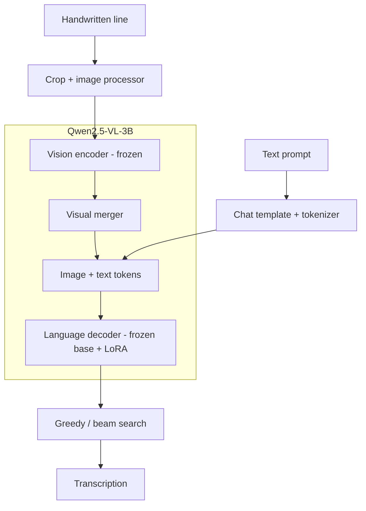

# Historical Handwriting Recognition with Qwen2.5-VL

Fine-tune Qwen2.5-VL-3B for handwritten line recognition with LoRA,
StackMix-style augmentation and minimum word error rate (MWER) training.

## Model architecture



**SFT:** update LoRA + visual merger. **MWER:** update LoRA only; merger frozen.

## Setup

Python 3.12+. Use a CUDA-enabled PyTorch build for pretrained 3B experiments.

```bash
python3 -m venv .venv
source .venv/bin/activate
python -m pip install -r requirements.txt
```

## Usage

Set the image directory and CSV path in [configs/data.yaml](configs/data.yaml).
Image paths are relative to `data.image_root`; the default split uses `writer_id`.

```csv
image_path,transcription,writer_id
lines/line_0001.png,"Received six shillings.",writer_A
lines/line_0002.png,"Paid in full, 1798.",writer_B
```

```bash
htr prepare-data --config configs/data.yaml
htr train-sft --config configs/sft.yaml
htr infer --config configs/inference.yaml
htr evaluate --config configs/inference.yaml
```

Checkpoints go to `runs/`; predictions and CER/WER metrics go to `outputs/`.
See the [training guide](docs/guide.md) for StackMix, MWER, beam search and ablations.

## Tests

```bash
python -m pytest -q
```

Tests use a small random model on CPU. Full pretrained 3B/CUDA training and
recognition accuracy have not yet been validated.

## License

[MIT](LICENSE). Model and dataset licenses are separate; weights and data are not included.
